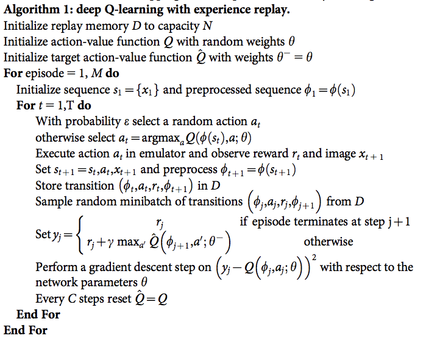

# Problem 1 (Banana Collector) Report

## Content

In this report you will find the following sections:

* Introduction
* Algorithm
* Model architecture
* Training procedure
* Agent performance

## Introduction

This report explains the implementation and training of a RL based agent that is able to solve the Banana Collector problem (see the README.md file for the problem details).

## Algorithm

In order to solve the problem the RL Agent has been trained with the DQN algorithm using Experience Replay and Fixed Q-Targets techniques.

### DQN Algorithm

The general expression of the DQN algorith is:

Please, read the [research paper](https://storage.googleapis.com/deepmind-media/dqn/DQNNaturePaper.pdf) for the complete details of the algorithm.

